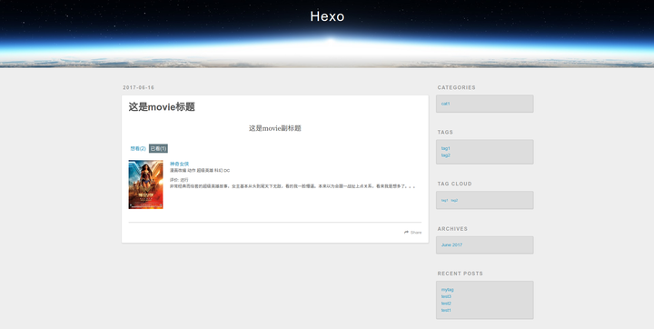
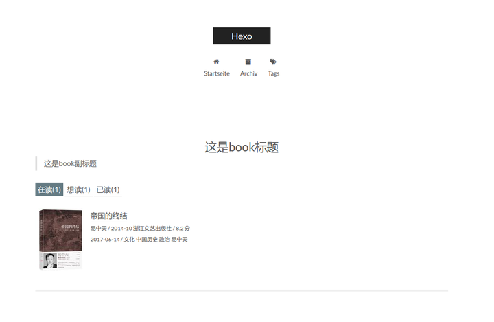
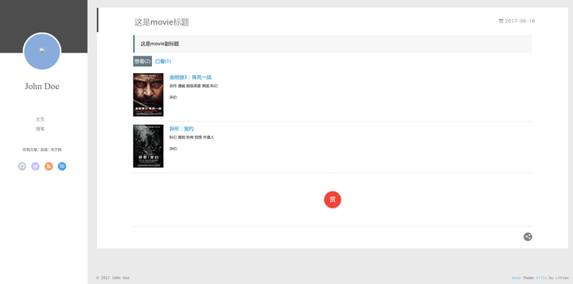
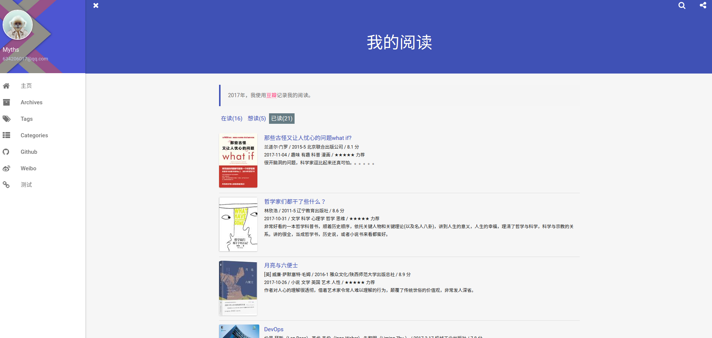
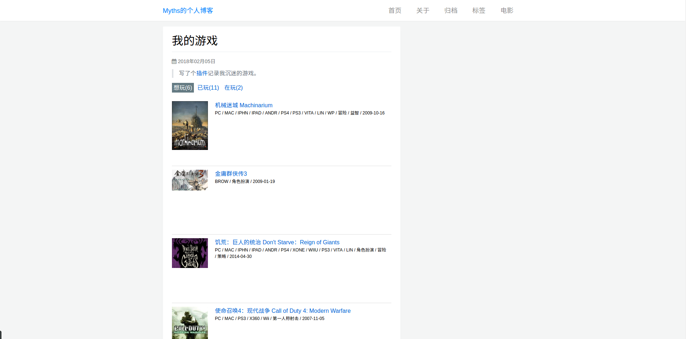

# hexo-douban

一个在 [Hexo](https://hexo.io) 页面中嵌入豆瓣个人主页的小插件.

[](https://nodejs.org/en/)
[](https://travis-ci.org/mythsman/hexo-douban)
[](https://coveralls.io/github/mythsman/hexo-douban?branch=master)
[](https://www.npmjs.com/package/hexo-douban)
[](https://www.npmjs.com/package/hexo-douban)
[](https://www.codacy.com/app/mythsman/hexo-douban?utm_source=github.com&amp;utm_medium=referral&amp;utm_content=mythsman/hexo-douban&amp;utm_campaign=Badge_Grade)
[](https://github.com/mythsman/hexo-douban/blob/master/LICENSE)

[](https://nodei.co/npm/hexo-douban/)

## 安装

``` bash
$ npm install hexo-douban --save
```

## 配置

将下面的配置写入站点的配置文件 `_config.yml` 里(不是主题的配置文件).

``` yaml
douban:
  user: mythsman
  builtin: false
  book:
    title: 'This is my book title'
    quote: 'This is my book quote'
  movie:
    title: 'This is my movie title'
    quote: 'This is my movie quote'
  game:
    title: 'This is my game title'
    quote: 'This is my game quote'
  timeout: 10000 
```

- **user**: 你的豆瓣ID.打开豆瓣，登入账户，然后在右上角点击 "个人主页" ，这时候地址栏的URL大概是这样："https://www.douban.com/people/xxxxxx/" ，其中的"xxxxxx"就是你的个人ID了。
- **builtin**: 是否将生成页面的功能嵌入`hexo s`和`hexo g`中，默认是`false`,另一可选项为`true`(1.x.x版本新增配置项)。
- **title**: 该页面的标题.
- **quote**: 写在页面开头的一段话,支持html语法.
- **timeout**: 爬取数据的超时时间，默认是 10000ms ,如果在使用时发现报了超时的错(ETIMEOUT)可以把这个数据设置的大一点。

如果只想显示某一个页面(比如movie)，那就把其他的配置项注释掉即可。

## 使用
### 1.x.x版本

在0.x.x版本中，文章的更新和豆瓣页面的爬取操作是绑定在一起的，无法支持单独更新文章或者单独爬取文章。

在1.x.x版本中，使用`hexo douban`命令即可生成指定页面，如果不加参数，那么默认参数为`-bgm`。

**需要注意的是**，通常大家都喜欢用`hexo d`来作为`hexo deploy`命令的简化，但是当安装了`hexo douban`之后，就不能用`hexo d`了，因为`hexo douban`跟`hexo deploy`的前缀都是`hexo d`。

```
$ hexo douban -h
Usage: hexo douban

Description:
Generate pages from douban

Options:
  -b, --books   Generate douban books only
  -g, --games   Generate douban games only
  -m, --movies  Generate douban movies only
```

如果配置了`builtin`参数为`true`，那么除了可以使用`hexo douban`命令之外，`hexo g`或`hexo s`也内嵌了生成页面的功能。

### 0.x.x版本
直接使用命令`hexo g`即在生成静态页面前爬取豆瓣数据，如果使用`hexo s`则会监听文件变动，每有一次变动就会重新爬取数据。

## 升级
我会不定期更新一些功能或者修改一些Bug，所以如果想使用最新的特性，可以用下面的方法来更新:

1. 修改package.json内hexo-douban的版本号至最新
2. 重新安装最新版本`npm install hexo-douban --save`

或者使用`npm install hexo-douban --update --save`直接更新。

## 显示
如果上面的配置和操作都没问题，就可以在生成站点之后打开 `//yourblog/books` 和 `//yourblog/movies`, `//yourblog/games`, 来查看结果.

## 菜单
如果上面的显示没有问题就可以在主题的配置文件 `_config.yml` 里添加如下配置来为这些页面添加菜单链接.
```yaml
menu:
  Home: /
  Archives: /archives
  Books: /books     #This is your books page
  Movies: /movies   #This is your movies page
  Games: /games   #This is your games page
```

## 更新记录
1.1.3
- 修复了读书页面rating信息没抓到的问题

1.1.2
- 修复在某些版本下全局变量找不到的问题

1.1.1
- 修复了读书页面评论丢失的问题。

1.1.0 
- 修复了由于豆瓣修改api导致读书页面无法抓取的问题

1.0.8
- 语言标识 zh-tw 修改为 zh-TW

1.0.7
- 修复游戏生成页面无法分页的bug

1.0.6
- 修复了builtin模式下有时候无法生成页面的bug

1.0.5
- 修复了空文件夹导致的bug

1.0.4
- 修复了文件流读取错误导致loading图加载失败的bug

1.0.3
- 放弃对IE/Edge的支持，取消了0.2.16版本的修改，保证了referrer的纯净性，从而提供对[不蒜子](http://busuanzi.ibruce.info)的支持

1.0.2
- 修复了对未配置项不支持的bug

1.0.1
- 优化了命令操作，提供`hexo douban`命令供单独页面的生成
- 将页面生成功能与hexo默认命令解耦，提供更大的操作自由度

0.2.16
- 修复了IE/Edge中读书页面图片无法显示的问题

0.2.15
- 修复了在网站在子目录下时某些资源链接不对的问题

0.2.14
- 修复了firefox下反防盗链失败的问题.......

0.2.13
- 修复了断网情况下报错导致无法继续生成页面的bug

0.2.12
- 添加图片懒加载的特性，减少首次加载时间
- 添加no-referrer的属性，反防盗链:)

0.2.11
- 修复了ejs@2.5.8版本出现非向下兼容的更新导致的异常

0.2.10
- 修复了页面在firefox浏览器打开时弹出about:blank的bug

0.2.9
- 紧急修复了由于豆瓣对前端代码做了简单重构导致的插件爬取电影信息异常的bug

0.2.8
- 为标签添加国际化设置，支持zh-Hans,zh-tw,en等
- 考虑到某些剧比较长，存在"在看"这个状态，因此为movie页添加"在看"标签

0.2.7
- 修复页面显示不正常的bug

0.2.6
- 添加分页效果
- 重构模板代码

0.2.5
- 修复无法适配某些主题的bug

## 截图
我们在下面这些常见的主题里测试了插件的使用效果:

### hexo-theme-landscape


### hexo-theme-next


### hexo-theme-yilia


### hexo-theme-indigo


### hexo-theme-aath


## 在线Demo

[books](https://blog.mythsman.com/books?from=hexo-douban)

[movies](https://blog.mythsman.com/movies?from=hexo-douban)

[games](https://blog.mythsman.com/games?from=hexo-douban)

## FeedBack
如果大家在使用的过程中有什么问题或者意见，欢迎随时提issue。

## Lisense
MIT
